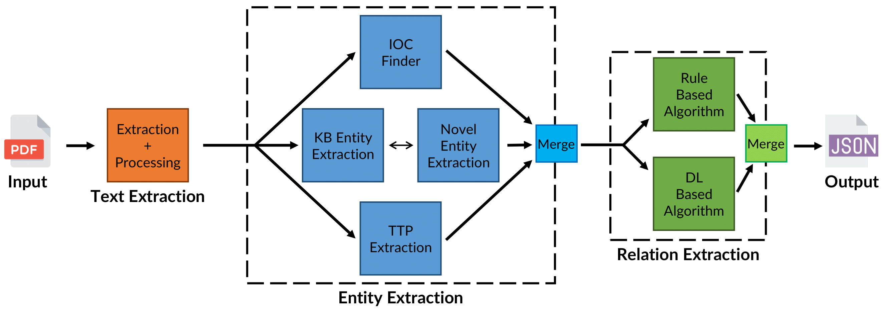

<div id="top"></div>
<!-- PROJECT LOGO -->
<br />
<div align="center">
  <a href="https://github.com/Mhackiori/STIXnet">
    
  </a>

  <h1 align="center">STIXnet</h1>

  <p align="center">
    A Novel and Modular Solution for Extracting All STIX Objects in CTI Reports
    <br />
    <a href="https://doi.org/10.1145/3600160.3600182"><strong>Paper available »</strong></a>
    <br />
    <br />
    <a href="https://www.math.unipd.it/~fmarchio/">Francesco Marchiori</a>
    ·
    <a href="https://www.math.unipd.it/~conti/">Mauro Conti</a>
    ·
    <a href="https://www.linkedin.com/in/ninoverde/">Nino Vincenzo Verde</a>
  </p>
</div>

<!-- TABLE OF CONTENTS -->
<details>
  <summary><strong>Table of Contents</strong></summary>
  <ol>
    <li>
      <a href="#abstract">Abstract</a>
    </li>
    <li>
      <a href="#citation">Citation</a>
    </li>
    <li>
      <a href="#usage">Usage</a>
    </li>
    <li>
      <a href="#pipeline">Pipeline</a>
      <ul>
        <li><a href="#entityextraction">Entity Extraction</a></li>
        <ul>
          <li><a href="#iocfinder">IOC Finder</a></li>
          <li><a href="#kb">Knowledge Base Entity Extraction</a></li>
          <li><a href="#rcatt">rcATT</a></li>
        </ul>
        <li><a href="#relationextraction">Relation Extraction</a></li>
      </ul>
    </li>
    <li>
      <a href="#evaluation">Evaluation</a>
    </li>
  </ol>
</details>


<div id="abstract"></div>

## 🧩 Abstract

>The automatic extraction of information from Cyber Threat Intelligence (CTI) reports is crucial in risk management. The increased frequency of the publications of these reports has led researchers to develop new systems for automatically recovering different types of entities and relations from textual data. Most state-of-the-art models leverage Natural Language Processing (NLP) techniques, which perform greatly in extracting a few types of entities at a time but cannot detect heterogeneous data or their relations. Furthermore, several paradigms, such as STIX, have become de facto standards in the CTI community and dictate a formal categorization of different entities and relations to enable organizations to share data consistently. This paper presents STIXnet, the first solution for the automated extraction of all STIX entities and relationships in CTI reports. Through the use of NLP techniques and an interactive Knowledge Base (KB) of entities, our approach obtains F1 scores comparable to state-of-the-art models for entity extraction (0.916) and relation extraction (0.724) while considering significantly more types of entities and relations. Moreover, STIXnet constitutes a modular and extensible framework that manages and coordinates different modules to merge their contributions uniquely and exhaustively. With our approach, researchers and organizations can extend their Information Extraction (IE) capabilities by integrating the efforts of several techniques without needing to develop new tools from scratch.

<p align="right"><a href="#top">(back to top)</a></p>
<div id="citation"></div>

## 🗣️ Citation

Please, cite this work when referring to STIXnet.

```
@inproceedings{10.1145/3600160.3600182,
    author = {Marchiori, Francesco and Conti, Mauro and Verde, Nino Vincenzo},
    title = {STIXnet: A Novel and Modular Solution for Extracting All STIX Objects in CTI Reports},
    year = {2023},
    isbn = {9798400707728},
    publisher = {Association for Computing Machinery},
    address = {New York, NY, USA},
    url = {https://doi.org/10.1145/3600160.3600182},
    doi = {10.1145/3600160.3600182},
    booktitle = {Proceedings of the 18th International Conference on Availability, Reliability and Security},
    articleno = {3},
    numpages = {11},
    keywords = {Cyber Threat Intelligence, STIX, Information Extraction, Natural Language Processing},
    location = {Benevento, Italy},
    series = {ARES '23}
}
```

<p align="right"><a href="#top">(back to top)</a></p>
<div id="usage"></div>

## ⚙️ Usage

To use the models, extract the datasets or run a module, start by cloning the repository:

```bash
git clone https://github.com/Mhackiori/STIXnet.git
cd STIXnet
```

Then, install the required Python packages by running:

```bash
pip install -r requirements.txt
```

<p align="right"><a href="#top">(back to top)</a></p>
<div id="pipeline"></div>

## 👷 Pipeline

STIXnet performs a highly complex Information Extraction task on many different types of entities and relations. There are indeed 18 different types of entities compliant with the STIX standard and more than 100 types of relations. To accomplish this, STIXnet uses different modules for each one of the different tasks that it must achieve: textual extraction, entity extraction, and relation extraction.



<p align="right"><a href="#top">(back to top)</a></p>
<div id="entityextraction"></div>

### 💡 Entity Extraction

This module handles the extraction of the different entities in the text. It uses four different sub-modules to accomplish that: **IOC Finder**, **Knowledge Base Entities Extraction**, **Novel Entities Extraction** and **TTPs Extraction**.

<div id="iocfinder"></div>

#### 👉 IOC Finder

The particular structure of Indicators Of Compromise allows us to use regular expression (Regex) rules to find them in the text. While different, all these indicators share a common structure across each type, which can be recognized with Regex rules without applying NLP techniques. Some examples of the types of IOCs supported by IOC Finder can be found in the following Table. In this repository we include our fork for IOC Finder that adapts to our framework.

| **IOC Type** | **IOC Structure**                |
|-----------------------|-------------------------------------------|
| ATT&CK Techniques     | T1518 or T1518.001 |
| CVEs                  | CVE-2021-44228                   |
| Email Addresses       | example@mail.com                 |
| File Paths            | /path/to/file                    |
| MD5s                  | e802c6b77dd5842906ed96ab1674c525 |

<div id="kb"></div>

#### 📙 Knowledge Base Entity Extraction

After finding IOCs, all other entities of interest do not share a common structure and thus cannot be found through regular expression rules. Thus, we leverage a rich Knowledge Base integrated with multiple OSINT that explicitly indicate which names represent important entities and allow us to link them to their correct entity type. In this repository, we include the [`nationalities.csv`](https://github.com/Mhackiori/STIXnet/blob/main/Entity-Extraction/Knowledge-Base/nationalities.csv) file that we use to extract locations.

<div id="rcatt"></div>

#### ⚔️ rcATT

While malwares and threat actors are often explicitly mentioned, some other entities are not and can be referenced without categorically stating their names. It is the case of tactics and techniques. We retrained [rcATT](https://github.com/vlegoy/rcATT) from scratch with new techniques and tactics. Also, to address one of the limitations and future works of the paper presenting rcATT, we expanded the training dataset with more data from MITRE ATT&CK descriptions and external sources for each tactic and technique.

<p align="right"><a href="#top">(back to top)</a></p>
<div id="relationextraction"></div>

### 🔀 Relation Extraction

This module can retrieve relations between the found entities while processing the sentences in the raw text. While submodules and parameters are detailed in the paper, in this repository we include the relationships that have been used for the comparison. Indeed, while STIX include SROs in their documentation, we translate them to be compliant with our framework for the comparison with relationships found in the report.

<p align="right"><a href="#top">(back to top)</a></p>
<div id="evaluation"></div>

## 🔎 Evaluation

Given the lack of available annotated reports in the literature, we generated our own [dataset](https://github.com/Mhackiori/STIXnet/tree/main/Dataset/Data) of CTI reports to evaluate our model. Each report treats a group or threat actor from the MITRE ATT&CK framework. All their related data has been extracted from their official descriptions and the external sources listed by the ATT&CK APIs. We then manually label each report with LabelStudio, a free and open-source software for data labeling. [Annotations](https://github.com/Mhackiori/STIXnet/blob/main/Dataset/Annotations.json) are exported in a JSON file and can be graphically visualized through the LabelStudio software.

<p align="right"><a href="#top">(back to top)</a></p>